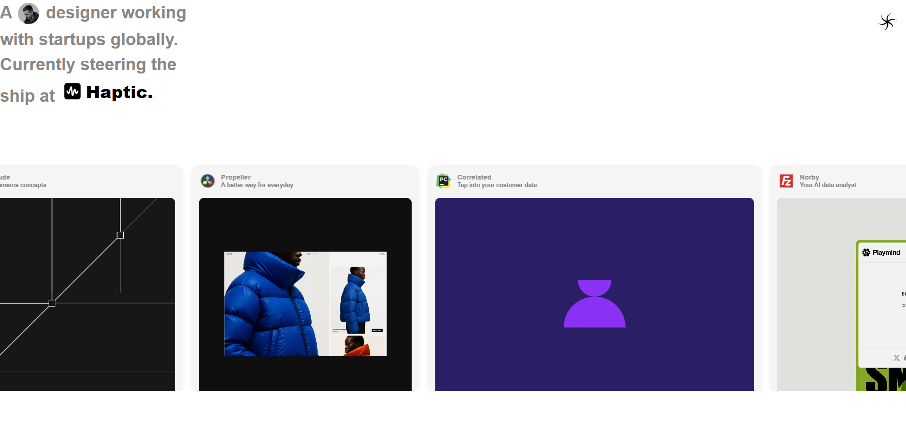
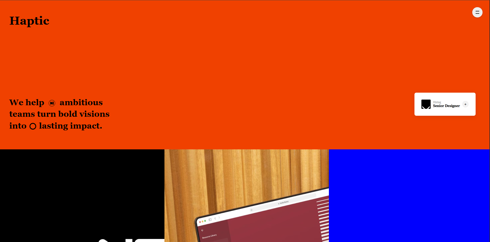
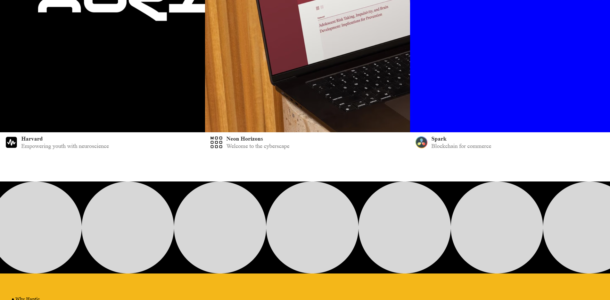

# 🧩 Solution Task

## 📌 Overview

This project was developed as part of an **internship at Solution Company**. It is a clean, responsive frontend built using **React** and **Tailwind CSS**. The layout replicates a designer portfolio-style interface and showcases a modern UI card gallery with project thumbnails. It's ideal for creative showcases or company profile demos.

> ✅ Ideal for frontend internship challenges, UI showcases, or building out a visual design portfolio.

## ⚙️ Installation

1. **Clone the repository**
   ```bash
   git clone https://github.com/Kusbah/Solution-task.git
   cd Solution-task
   ```

2. **Install dependencies**
   ```bash
   npm install
   ```

3. **Start the development server**
   ```bash
   npm run dev
   ```

4. **Open in your browser**
   ```
   http://localhost:5173
   ```

> ⚠️ You need to have [Node.js](https://nodejs.org/) and [npm](https://www.npmjs.com/) installed.

---

## 🖼️ Screenshots

### 🎯 Designer Portfolio Section


### 🧡 Haptic Visual Hero


### 🎓 Harvard & Spark Section


### 🎧 Why Haptic (Testimonial Area)


---

## 🚀 Contribution

Feel free to fork this project and enhance it. Pull requests are welcome.
